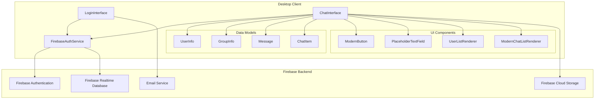
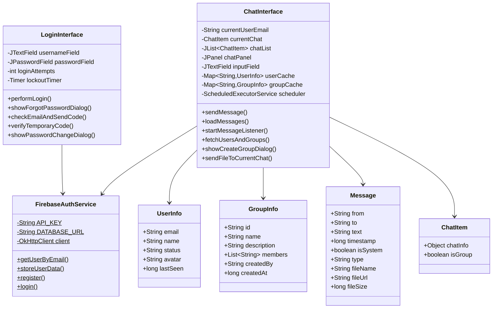
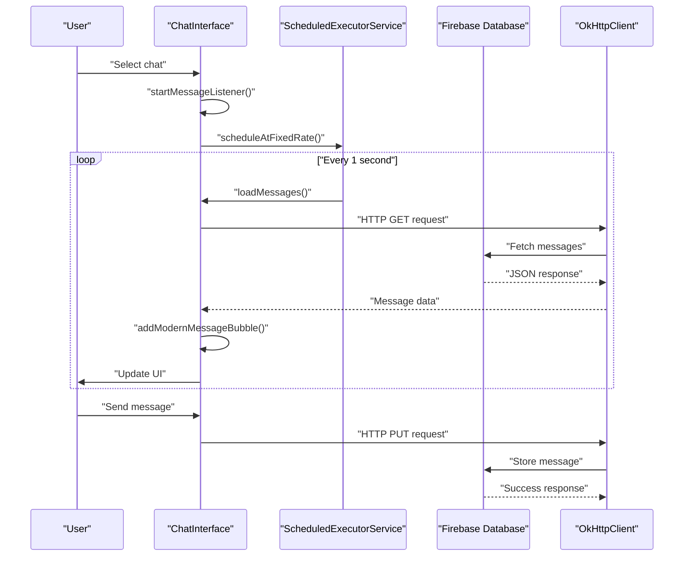
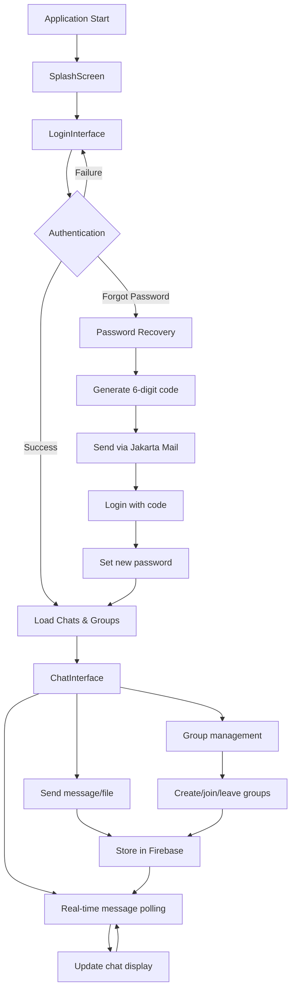

 
 
 

# LinkApp 

This document provides a comprehensive overview of LinkApp, a Java-based desktop chat application that enables real-time messaging between users and groups. The application features a modern Swing-based graphical user interface with Firebase backend integration for authentication, data storage, and file sharing capabilities.

LinkApp is designed as a standalone desktop application that connects users through a centralized Firebase backend, supporting both one-to-one conversations and group chats with real-time message delivery and file sharing functionality.

## System Architecture

LinkApp follows a client-server architecture where the Java Swing desktop client communicates with Firebase services for all backend operations. The application is structured around two main interface classes that handle the complete user workflow from authentication to messaging.



## Core Application Components

The application consists of two primary interface classes that manage the complete user experience, supported by a service layer and data models that handle backend integration and data representation.



## Authentication and Session Management

The authentication system handles user login, registration, and password recovery through Firebase Authentication API. The `LoginInterface` class manages the complete authentication workflow including temporary code generation for password recovery.

| Feature | Implementation | Location |
|---------|---------------|----------|
| User Login | Email/password validation with Firebase | LoginInterface.performLogin() |
| Registration | User account creation with Firebase | LoginInterface.showRegistrationDialog() |
| Password Recovery | Temporary 6-digit code via email | LoginInterface.checkEmailAndSendCode() |
| Session Management | Automatic login state persistence | LoginInterface.saveCredentials() |
| Account Lockout | 3-attempt limit with 30-second timeout | LoginInterface.startLockoutTimer() |

The authentication flow uses HTTP requests to Firebase Authentication API through the `FirebaseAuthService` class, which provides static methods for user management operations. Password recovery is implemented with temporary codes stored in Firebase Database and sent via Jakarta Mail API.

## Real-time Messaging System

The messaging system implements real-time communication through Firebase Realtime Database with automatic message synchronization. The `ChatInterface` class uses a scheduled executor service to poll for new messages every second.



## Technology Stack and Dependencies

LinkApp is built using modern Java technologies with external dependencies managed through Maven. The application targets Java 11+ runtime environments and uses established libraries for HTTP communication, JSON processing, and UI enhancement.

| Technology | Version | Purpose |
|------------|---------|---------|
| Java | 11+ | Core runtime environment |
| Maven | 3.x | Build and dependency management |
| Java Swing | Built-in | Desktop GUI framework |
| Firebase | 9.1.1 | Backend services (auth, database, storage) |
| OkHttp | 4.10.0 | HTTP client for Firebase API calls |
| JSON-java | 20230227 | JSON parsing and generation |
| Ikonli | 12.3.1 | Icon libraries (FontAwesome, Material Design) |
| Jakarta Mail | 2.0.1 | Email functionality for password recovery |

The build configuration uses Maven with JPackage plugin for creating native application installers. The application can be packaged as standalone executables for different operating systems through the `jpackage-maven-plugin`.

## Application Workflow

The complete application workflow progresses from authentication through chat functionality, with each major component handling specific aspects of the user experience.


## Screenshots  
  
### Loading Splashcreen


*A loading Interface that loads the application*  

### Login Interface  

 
*Clean and modern login interface with LinkApp branding*
  
### Chat Interface  


*Real-time messaging with user and group chat support*  
  
### File Sharing  

 
*Custom file picker with image preview functionality*
  
  
### Group Management  


*Create and manage group conversations*

## Getting Started


### Prerequisites

Before running LinkApp, ensure you have the following installed:

- **Java 11 or higher** (Java 17 recommended for optimal performance)
- **Maven 3.6+** for dependency management and building
- **Git** for cloning the repository

### Installation & Setup

1. **Clone the repository**
   ```bash
   git clone https://github.com/houcine0078/LinkApp.git
   cd LinkApp
   

2. **Configure Firebase credentials**
   
   Create a `config.properties` file in the project root with your Firebase configuration:
   ```properties
   FIREBASE_API_KEY=your_firebase_api_key_here
   FIREBASE_DATABASE_URL=https://your-project-default-rtdb.firebaseio.com/
   ``` [1](#4-0) 

3. **Install dependencies and compile**
   ```bash
   mvn clean install
   mvn compile
   ```

4. **Run the application**
   ```bash
   mvn exec:java -Dexec.mainClass="Interfaces.LoginInterface"
   ```
   
   Or alternatively, if you have an IDE like IntelliJ IDEA or Eclipse:
   - Import the project as a Maven project
   - Run the `LoginInterface` class directly

### Building Native Installers (Optional)

LinkApp includes JPackage configuration for creating native installers:

```bash
mvn clean compile
mvn jpackage:jpackage
```

The installer will be generated in the `target/dist` directory. 

### First Run Setup

1. **Launch the application** - The LoginInterface will appear 
2. **Create an account** - Click "Create Account" to register a new user
3. **Login** - Use your credentials to access the chat interface
4. **Start chatting** - Add friends by email or create group conversations

### Troubleshooting

- **Firebase connection issues**: Verify your `config.properties` file contains valid Firebase credentials
- **Java version errors**: Ensure you're using Java 11 or higher
- **Build failures**: Run `mvn clean` before rebuilding
- **Email functionality**: For password recovery features, ensure proper SMTP configuration

### Development Mode

For development, you can run the application directly from your IDE by executing the `main` method in `LoginInterface.java`.

## Features

- Real-time messaging
- Group chat functionality
- File sharing capabilities
- User authentication and registration
- Password recovery via email
- Modern Swing UI with custom components
- Firebase backend integration

## License

This project is open source and available under the MIT License.
